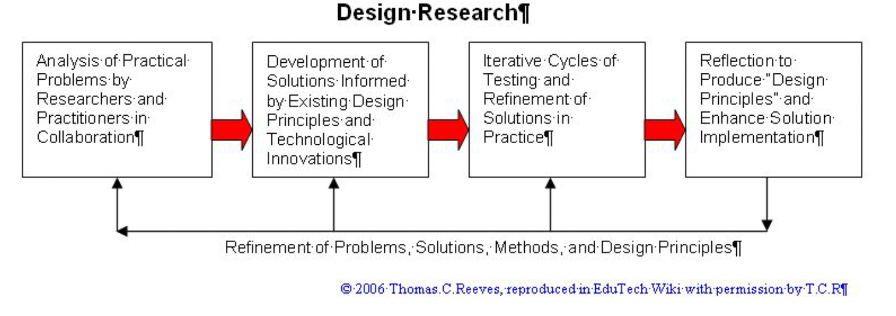

# Co-aligning ICT Experiences

## Introduction 

Purpose of this article targets 2 goals based on Hevner's (2007) DSR Cycles:

- relevance cycle (to IMPROVE the environment (identify opportunities and problems, evaluation)): provide a detailed and beginner-friendly overview of a well-studied problem, which is creation of websites - artifact;

- rigor cycle (draw on ref.theories and state of the art, add to them): provide detailed, systematic and illustrative (potentially - interactive (pudding? vizes?)) mapping of multiple points of views on this process - system thinking, design thinking, complexity and project management - empirical?;

    - max (INVENT): set systems of sufficient competences on PoVs and determine interactions and conflicts between these PoVs. ideally -  in the form of causal model <3 - methodological???. -->

The idea is mostly inherited from my MSc degree learning design, continuing the dialogue on the co-alignment of different fields while taking into account students’ and instructors’ perceptions ([Musabirov et.al., 2020](https://educhi2020.educhi.org/wp-content/uploads/2020/04/educhi2020-final38.pdf)).

* collaborative environment for diverse people - the growing amount of PEOPLE IN THE WORLD IN GENERAL devalues traditional patchwork-like curricula and redirect learning design towards smt like 4C/ID - something relevant, engaging, and clear.
* trade-offs between design requirements and architecture
* "transcend the patchwork nature of traditional course-based curricula, in which course boundaries
define and restrict the scope of students’ work"

## Literature:

* DSR cases book on Desktop
* https://aisel.aisnet.org/cgi/viewcontent.cgi?article=1018&context=sjis
* https://aisel.aisnet.org/cgi/viewcontent.cgi?article=1017&context=sjis 

### Books

* Stephen Wendel. 2013. Designing for Behavior Change. O’Reilly Media, Inc
* Donald A. Norman. 2013. The design of everyday things (revised and expanded edition ed.). Basic Books, New York.
* Jenny Preece, Helen Sharp, and Yvonne Rogers. 2015. Interaction Design: Beyond Human-Computer Interaction (4 edition ed.). Wiley, Chichester.

### Papers
* Ilya Musabirov, Alena Suvorova, Denis Bulygin, and Pavel Okopnyi. 2020. Co-aligning UX & Development Courses:
The Case of MSc in Information Systems and HCI. In Proceedings of EduCHI ’20. ACM, New York, NY, USA,
7 pages. https://doi.org/10.1145/nnnnnnn.nnnnnnn  
* Ariane Rodrigues, Dalai Ribeiro, and Simone Barbosa. 2018. Bringing Knowledge Bites to a PocketSize Curriculum for
Teaching HCI. In CHI 2018 workshop on Developing a Community of Practice to Support Global HCI Education.  
* Anne Roudaut, Orit Shaer, Audrey Girouard, and Andrew Kun. 2018. Identifying Challenges within HCI Education. In
CHI 2018 workshop on Developing a Community of Practice to Support Global HCI Education.