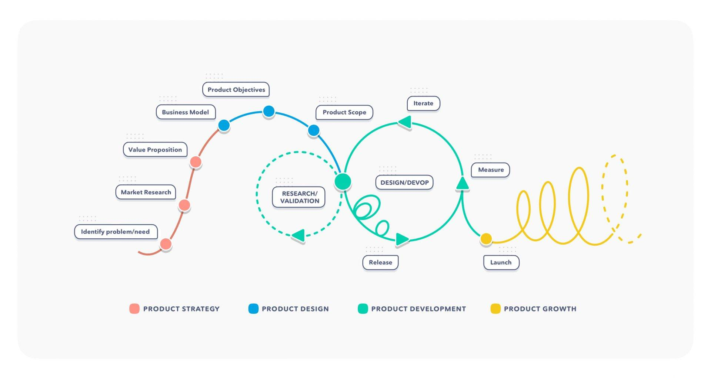

<!--  -->
### TODO: lifecycle comes later after methodologies
<!--  -->

> Management was always a thing I disliked the most in my education - probably because it's not a think that can be studies in university environment. But more and more things containing this word have worked out for me: time management, sleep management, anger management. So by doing this project, I would also like to understand ***project and product management***, as it is now an integral plan of any S&T activity. And we start with...

# Digital Product Life Cycle 

I imagine this thing as a loose plan of stages during digital product creation, from the very first idea to launch and support.

In realm of personal and small collaborative projects, no one will plan so detailed. But that doesn't mean that steps you following are anyhow different from general models! Let's break them down ([src](https://uruit.com/blog/digital-product-lifecycle/)).

## Strategy

## Design

## Development

## Growth

